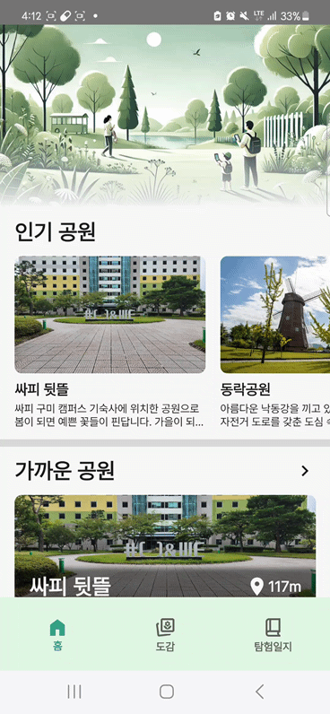
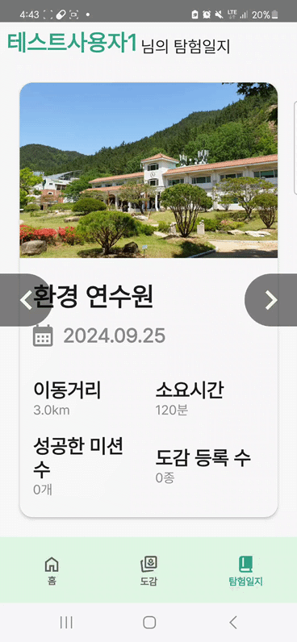
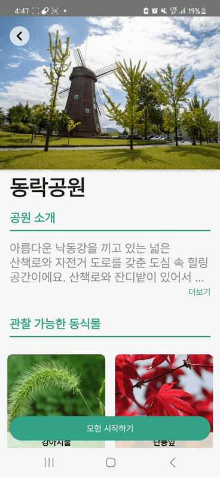
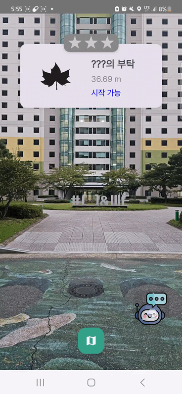

# 🌿 이게모야


- **배포 URL**: [여기를 클릭!](https://drive.google.com/file/d/1k9GySrYQOmmSf7QQYjYC5yBoUvQVIuZT/view?usp=sharing)
- **Test 사용자 ID**: 네이버 로그인
- **Test 사용자 PW**: 네이버 로그인

## 📜 목차

1. [프로젝트 소개 및 핵심 기능](#1-프로젝트-소개-및-핵심-기능-)
2. [팀원 구성](#2-팀원-구성-)
3. [개발 환경](#3-개발-환경-️)
4. [채택한 개발 기술](#4-채택한-개발-기술-)
5. [프로젝트 구조](#5-프로젝트-구조-️)
6. [기능](#6-기능-)
7. [트러블 슈팅](#7-트러블-슈팅-️)
8. [성능 개선한 목록](#8-성능-개선한-목록-)
9. [프로젝트 사용 도구](#9-프로젝트-사용-도구-️)
10. [외부 서비스](#10-외부-서비스-)
11. [개발 및 배포 컨벤션](#11-개발-및-배포-컨벤션-)

## 1. 프로젝트 소개 및 핵심 기능 🌳🔍

**생태공원 탐험학습 도우미**  
자연 탐험과 학습을 돕기 위한 게이미피케이션 기반의 AR/AI 동식물 탐험 애플리케이션입니다.

### 주요 기능

1. **생태공원 정보 안내**: 다양한 생태공원의 정보를 제공하여 사용자가 탐험할 공원을 선택할 수 있습니다.
2. **공원 내 위치기반 AR 길 안내**: AR 기술을 활용하여 공원 내에서 사용자의 위치를 기반으로 시각적인 길 안내를 제공합니다.
3. **카메라로 실시간 동식물 판별**: 카메라를 통해 실시간으로 동식물을 판별하고 도감에 기록할 수 있습니다.
4. **동식물 도감 및 LLM을 활용한 도우미 기능**: 수집한 동식물 정보를 도감에 저장하고, 대규모 언어 모델(LLM)을 활용하여 추가 정보를 제공합니다.

## 2. 팀원 구성 👥

| **강미연**                              | **김은섭**                                 | **서장원**                                  | **김성수**                              | **여창민**                              | **최지훈**                                 |
| ------------------------------------ | --------------------------------------- | ---------------------------------------- | ------------------------------------ | ------------------------------------ | --------------------------------------- |
| 백엔드                                  | 백엔드                                     | 백엔드                                      | 안드로이드                                | 안드로이드                                | 안드로이드                                   |
| [GitHub](https://github.com/422haha) | [Github](https://github.com/subway9852) | [Github](https://github.com/Seo-Jangwon) | [Github](https://github.com/DrSkele) | [Github](https://github.com/yeolife) | [Github](https://github.com/choi-jihun) |

## 3. 개발 환경 🛠️

- **프론트엔드**: Android Studio Koala, Kotlin, MVI
- **백엔드**: IntelliJ IDEA, Java 17, Spring Boot 3.3.1
- **AI**: Python 3.12, Java 17, YOLOv8 latest, Langchain4j 0.34.0, PyTorch 2.4.1+cu121, nvidia graphic driver 535.183.01, CUDA 12.2
- **데이터베이스**: PostgreSQL 16.4, Redis
- **인프라**: Ubuntu 20.04.6

## 4. 채택한 개발 기술 🚀

### Android 📱

- **Jetpack Compose**: 선언형 API를 사용하여 앱 UI를 더 쉽게 작성하고 유지관리할 수 있습니다.
- **Hilt**: 의존성 주입을 통해 객체의 생성을 관리함으로써 코드의 모듈화와 재사용성을 극대화할 수 있습니다.
- **Coil**: 이미지 로딩을 간편하게 할 수 있습니다.
- **DataStore**: Access Token, Refresh Token 저장하기 위해 사용했습니다.
- **Serialization**: 백엔드 서버에서 불러오는 데이터를 JSON 직렬화를 위해 사용했습니다.
- **Retrofit2**: 백엔드 서버와의 HTTP 요청을 인터페이스 메서드로 매핑하여, 네트워크 요청 로직을 직관적이고 쉽게 작성할 수 있습니다.
- **Naver Map**: 네이버 지도를 사용하여, 생태공원의 AR NPC와 동식물 위치를 마커로 정보 제공합니다.
- **GMS Location**: 가까운 생태공원 목록을 찾기 위해 현재 위치를 요청하거나, AR 배치를 위한 5초 간격마다 현재 위치를 요청하기 위해 사용합니다.
- **ARSceneView**: 공원에 증강현실 3D NPC를 배치할 수 있습니다.
- **ONNX**: 미션 수행 및 도감 수집에서 동식물 객체 인식을 위한 온디바이스 AI를 사용하며, AI 모델은 YOLOv8 small Object Detection을 사용했습니다.

### Backend 🖥️

- **Redis**: 자주 접근하는 데이터를 Redis에 캐싱함으로써 데이터베이스 조회 횟수를 줄여 전체 시스템 성능을 향상시킵니다.
- **JPA**: 객체 지향적인 방식으로 데이터베이스를 조작할 수 있어, 사용자 정보나 탐험 기록 등을 효율적으로 관리할 수 있습니다.
- **Spring Security**: URL 기반의 세밀한 접근 제어를 통해 사용자 권한을 효과적으로 관리할 수 있습니다.
- **JWT**: 서버의 부하를 줄이고 확장성을 향상시키기 위해 세션 대신 토큰 기반 인증을 채택하였습니다.
- **PostGIS**: 지리 정보를 저장하고 처리하기 위해 PostGIS를 사용하여 공원 위치, 동식물의 위치 등의 공간 데이터를 효율적으로 관리합니다.
- **Docker**: 애플리케이션을 컨테이너화하여 일관된 배포 환경을 제공하고, CI/CD 파이프라인에서의 자동화 배포를 지원합니다.
- **Jenkins**: 자동화된 빌드 및 배포 프로세스를 관리하며, Blue-Green 배포 전략을 통해 무중단 배포를 구현합니다.
- **Nginx**: 리버스 프록시 설정을 통해 요청을 처리하며, Blue-Green 배포 시 트래픽을 새로운 버전의 애플리케이션으로 라우팅합니다.
- **AWS EC2**: 서버 인스턴스를 호스팅하여 애플리케이션을 배포하고, Docker 및 Jenkins와 연동하여 CI/CD 환경을 구성합니다.
- **Langchain4j**: 챗봇 기능에서 RAG(문서 추출 및 벡터 DB 기반) 기술을 사용하여 사용자 정보와 DB 데이터를 바탕으로 답변을 제공합니다. 별도의 Python 서버 없이, Java 기반으로 통합된 환경에서 AI 기능을 구현하여 효율적인 시스템 구성을 지원합니다.
- **Fail2Ban & ModSecurity**: 서버의 보안 강화를 위해 사용하여 공격 시도를 탐지하고 차단합니다.
- **Let's Encrypt**: SSL/TLS 인증서를 사용하여 HTTPS를 적용하고 보안된 통신을 지원합니다.

## 5. 프로젝트 구조 🏗️

### Android 📱

<details>
<summary>접기/펼치기</summary>

```
C:.
├─.idea
│  └─inspectionProfiles
├─app
│  └─src
│      ├─androidTest
│      │  └─java
│      │      └─com
│      │          └─ssafy
│      │              └─moya
│      ├─main
│      │  ├─java
│      │  │  └─com
│      │  │      └─ssafy
│      │  │          └─moya
│      │  │              ├─navigation
│      │  │              └─ui
│      │  │                  └─theme
│      │  └─res
│      │      ├─drawable
│      │      ├─mipmap-anydpi-v26
│      │      ├─mipmap-hdpi
│      │      ├─mipmap-mdpi
│      │      ├─mipmap-xhdpi
│      │      ├─mipmap-xxhdpi
│      │      ├─mipmap-xxxhdpi
│      │      ├─values
│      │      └─xml
│      └─test
│          └─java
│              └─com
│                  └─ssafy
│                      └─moya
├─build-logic
│  └─convention
│      └─src
│          └─main
│              └─java
│                  └─com
│                      └─ssafy
│                          └─convention
│                              └─extension
├─core
│  ├─datastore
│  │  └─src
│  │      ├─androidTest
│  │      │  └─java
│  │      │      └─com
│  │      │          └─ssafy
│  │      │              └─datastore
│  │      ├─main
│  │      │  └─java
│  │      │      └─com
│  │      │          └─ssafy
│  │      │              └─datastore
│  │      │                  ├─di
│  │      │                  └─repository
│  │      └─test
│  │          └─java
│  │              └─com
│  │                  └─ssafy
│  │                      └─datastore
│  ├─location
│  │  └─src
│  │      ├─androidTest
│  │      │  └─java
│  │      │      └─com
│  │      │          └─skele
│  │      │              └─moya
│  │      │                  └─background
│  │      ├─main
│  │      │  └─java
│  │      │      └─com
│  │      │          └─skele
│  │      │              └─moya
│  │      │                  └─background
│  │      │                      ├─di
│  │      │                      └─util
│  │      └─test
│  │          └─java
│  │              └─com
│  │                  └─skele
│  │                      └─moya
│  │                          └─background
│  ├─model
│  │  └─src
│  │      ├─androidTest
│  │      │  └─java
│  │      │      └─com
│  │      │          └─ssafy
│  │      │              └─model
│  │      ├─main
│  │      │  └─java
│  │      │      └─com
│  │      │          └─ssafy
│  │      │              └─model
│  │      │                  ├─encyclopediadetail
│  │      │                  └─encyclopedialist
│  │      └─test
│  │          └─java
│  │              └─com
│  │                  └─ssafy
│  │                      └─model
│  ├─network
│  │  └─src
│  │      ├─androidTest
│  │      │  └─java
│  │      │      └─com
│  │      │          └─ssafy
│  │      │              └─network
│  │      ├─main
│  │      │  └─java
│  │      │      └─com
│  │      │          └─ssafy
│  │      │              └─network
│  │      │                  ├─api
│  │      │                  ├─di
│  │      │                  ├─interceptor
│  │      │                  ├─repository
│  │      │                  ├─repositoryImpl
│  │      │                  ├─request
│  │      │                  └─util
│  │      └─test
│  │          └─java
│  │              └─com
│  │                  └─ssafy
│  │                      └─network
│  ├─src
│  │  └─main
│  │      └─java
│  │          └─com
│  │              └─ssafy
│  │                  └─core
│  └─ui
│      └─src
│          ├─androidTest
│          │  └─java
│          │      └─com
│          │          └─ssafy
│          │              └─ui
│          ├─main
│          │  ├─java
│          │  │  └─com
│          │  │      └─ssafy
│          │  │          └─ui
│          │  │              ├─component
│          │  │              ├─encycdetail
│          │  │              ├─encyclopedia
│          │  │              ├─exploredetail
│          │  │              ├─explorelist
│          │  │              ├─explorestart
│          │  │              ├─extension
│          │  │              ├─home
│          │  │              ├─login
│          │  │              ├─navigationbar
│          │  │              ├─parkdetail
│          │  │              ├─parklist
│          │  │              ├─screen
│          │  │              └─theme
│          │  └─res
│          │      ├─drawable
│          │      └─font
│          └─test
│              └─java
│                  └─com
│                      └─ssafy
│                          └─ui
├─demo
│  └─src
│      ├─androidTest
│      │  └─java
│      │      └─com
│      │          └─ssafy
│      │              └─demo
│      ├─main
│      │  ├─java
│      │  │  └─com
│      │  │      └─ssafy
│      │  │          └─demo
│      │  │              └─ui
│      │  │                  └─theme
│      │  └─res
│      │      ├─drawable
│      │      ├─mipmap-anydpi
│      │      ├─mipmap-hdpi
│      │      ├─mipmap-mdpi
│      │      ├─mipmap-xhdpi
│      │      ├─mipmap-xxhdpi
│      │      ├─mipmap-xxxhdpi
│      │      └─values
│      └─test
│          └─java
│              └─com
│                  └─ssafy
│                      └─demo
├─feat
│  ├─ai
│  │  └─src
│  │      ├─androidTest
│  │      │  └─java
│  │      │      └─com
│  │      │          └─ssafy
│  │      │              └─moya
│  │      │                  └─ai
│  │      ├─main
│  │      │  ├─assets
│  │      │  └─java
│  │      │      └─com
│  │      │          └─ssafy
│  │      │              └─moya
│  │      │                  └─ai
│  │      └─test
│  │          └─java
│  │              └─com
│  │                  └─ssafy
│  │                      └─moya
│  │                          └─ai
│  ├─ar
│  │  └─src
│  │      ├─androidTest
│  │      │  └─java
│  │      │      └─com
│  │      │          └─ssafy
│  │      │              └─ar
│  │      ├─main
│  │      │  ├─assets
│  │      │  │  ├─models
│  │      │  │  └─picture
│  │      │  ├─java
│  │      │  │  └─com
│  │      │  │      └─ssafy
│  │      │  │          └─ar
│  │      │  │              ├─data
│  │      │  │              ├─dummy
│  │      │  │              ├─manager
│  │      │  │              ├─ui
│  │      │  │              └─util
│  │      │  └─res
│  │      │      └─drawable
│  │      └─test
│  │          └─java
│  │              └─com
│  │                  └─ssafy
│  │                      └─ar
│  ├─login
│  │  └─src
│  │      ├─androidTest
│  │      │  └─java
│  │      │      └─com
│  │      │          └─ssafy
│  │      │              └─moya
│  │      │                  └─login
│  │      ├─main
│  │      │  └─java
│  │      │      └─com
│  │      │          └─ssafy
│  │      │              └─moya
│  │      │                  └─login
│  │      └─test
│  │          └─java
│  │              └─com
│  │                  └─ssafy
│  │                      └─moya
│  │                          └─login
│  └─main
│      └─src
│          ├─androidTest
│          │  └─java
│          │      └─com
│          │          └─ssafy
│          │              └─main
│          ├─main
│          │  └─java
│          │      └─com
│          │          └─ssafy
│          │              └─main
│          │                  ├─dialog
│          │                  ├─encycdetail
│          │                  ├─encyclopedia
│          │                  ├─exploredetail
│          │                  ├─explorelist
│          │                  ├─explorestart
│          │                  ├─home
│          │                  ├─login
│          │                  ├─parkdetail
│          │                  ├─parklist
│          │                  └─util
│          └─test
│              └─java
│                  └─com
│                      └─ssafy
│                          └─main
└─gradle
    └─wrapper
```

</details>

### Backend 🖥️

<details>
<summary>접기/펼치기</summary>

```
C:.
├─.idea
├─.mvn
│  └─wrapper
├─src
│  ├─main
│  │  ├─java
│  │  │  └─com
│  │  │      └─e22e
│  │  │          └─moya
│  │  │              ├─chat
│  │  │              │  ├─controller
│  │  │              │  ├─dto
│  │  │              │  ├─repository
│  │  │              │  └─service
│  │  │              ├─collection
│  │  │              │  ├─controller
│  │  │              │  ├─dto
│  │  │              │  ├─repository
│  │  │              │  └─service
│  │  │              ├─common
│  │  │              │  ├─config
│  │  │              │  ├─constants
│  │  │              │  ├─controller
│  │  │              │  ├─entity
│  │  │              │  │  ├─chatting
│  │  │              │  │  ├─npc
│  │  │              │  │  ├─park
│  │  │              │  │  ├─quest
│  │  │              │  │  └─species
│  │  │              │  ├─filter
│  │  │              │  ├─handler
│  │  │              │  ├─s3Service
│  │  │              │  └─util
│  │  │              ├─diary
│  │  │              │  ├─controller
│  │  │              │  ├─dto
│  │  │              │  ├─repository
│  │  │              │  └─service
│  │  │              ├─exploration
│  │  │              │  ├─controller
│  │  │              │  ├─dto
│  │  │              │  │  ├─exploration
│  │  │              │  │  ├─info
│  │  │              │  │  └─quest
│  │  │              │  │      ├─complete
│  │  │              │  │      └─list
│  │  │              │  ├─repository
│  │  │              │  └─service
│  │  │              │      ├─exploration
│  │  │              │      ├─info
│  │  │              │      └─quest
│  │  │              ├─park
│  │  │              │  ├─controller
│  │  │              │  ├─dto
│  │  │              │  ├─repository
│  │  │              │  └─service
│  │  │              ├─season
│  │  │              │  ├─controller
│  │  │              │  ├─dto
│  │  │              │  ├─repository
│  │  │              │  └─service
│  │  │              └─user
│  │  │                  ├─controller
│  │  │                  ├─dto
│  │  │                  ├─repository
│  │  │                  └─service
│  │  │                      ├─jwt
│  │  │                      ├─oauth
│  │  │                      └─user
│  │  └─resources
│  └─test
│      └─java
│          └─com
│              └─e22e
│                  └─moya
│                      ├─exploration
│                      │  └─service
│                      │      ├─exploration
│                      │      └─quest
│                      └─park
│                          ├─controller
│                          └─service
└─target
    ├─classes
    │  └─com
    │      └─e22e
    │          └─moya
    │              ├─chat
    │              │  ├─controller
    │              │  ├─dto
    │              │  ├─repository
    │              │  └─service
    │              ├─collection
    │              │  ├─controller
    │              │  ├─dto
    │              │  ├─repository
    │              │  └─service
    │              ├─common
    │              │  ├─config
    │              │  ├─constants
    │              │  ├─controller
    │              │  ├─entity
    │              │  │  ├─chatting
    │              │  │  ├─npc
    │              │  │  ├─park
    │              │  │  ├─quest
    │              │  │  └─species
    │              │  ├─filter
    │              │  ├─handler
    │              │  ├─s3Service
    │              │  └─util
    │              ├─diary
    │              │  ├─controller
    │              │  ├─dto
    │              │  ├─repository
    │              │  └─service
    │              ├─exploration
    │              │  ├─controller
    │              │  ├─dto
    │              │  │  ├─exploration
    │              │  │  ├─info
    │              │  │  └─quest
    │              │  │      ├─complete
    │              │  │      └─list
    │              │  ├─repository
    │              │  └─service
    │              │      ├─exploration
    │              │      ├─info
    │              │      └─quest
    │              ├─park
    │              │  ├─controller
    │              │  ├─dto
    │              │  ├─repository
    │              │  └─service
    │              ├─season
    │              │  ├─controller
    │              │  ├─dto
    │              │  ├─repository
    │              │  └─service
    │              └─user
    │                  ├─controller
    │                  ├─dto
    │                  ├─repository
    │                  └─service
    │                      ├─jwt
    │                      ├─oauth
    │                      └─user
    ├─generated-sources
    │  ├─annotations
    │  └─java
    │      └─com
    │          └─e22e
    │              └─moya
    │                  └─common
    │                      └─entity
    │                          ├─chatting
    │                          ├─npc
    │                          ├─park
    │                          ├─quest
    │                          └─species
    ├─generated-test-sources
    │  └─test-annotations
    ├─maven-archiver
    ├─maven-status
    │  └─maven-compiler-plugin
    │      ├─compile
    │      │  └─default-compile
    │      └─testCompile
    │          └─default-testCompile
    ├─surefire-reports
    └─test-classes
        └─com
            └─e22e
                └─moya
                    ├─exploration
                    │  └─service
                    │      ├─exploration
                    │      └─quest
                    └─park
                        ├─controller
                        └─service
```

</details>

## 6. 기능 ✨

### 홈 탭 🏡

- 주변 인기 공원, 가까운 공원, 계절별 인기 동식물을 한눈에 확인할 수 있습니다.
- 각 공원에 대한 상세 정보를 통해 탐험을 계획할 수 있습니다.



### 도감 탭 📖

- 수집한 동식물을 확인하고 관리할 수 있습니다.
- LLM을 활용하여 각 동식물에 대한 상세한 정보를 제공합니다.


### 탐험일지 탭 📝

- 과거에 진행한 탐험 목록을 조회할 수 있습니다.
- 각 탐험 기록을 통해 이전 탐험의 성과를 확인할 수 있습니다.



### 공원정보 탭 🏞️

- 각 공원의 소개와 관찰 가능한 동식물 정보를 제공합니다.
- 사용자가 방문할 공원을 선택하고 탐험을 준비할 수 있습니다.



### 모험 시작 탭 🎯

- 지도 환경에서 서비스를 시작하고 AR 탐험을 진행합니다.
- AR 기술을 활용하여 공원 내에서 시각적인 길 안내를 제공합니다.


### 도감 등록 탭 🖼️

- On-Device 실시간 동식물 수집 기능을 통해 동식물을 도감에 등록할 수 있습니다.
- 카메라를 통해 실시간으로 동식물을 판별하고 자동으로 도감에 기록됩니다.


### 도전과제 탭 🏆

- AR NPC 퀘스트 기능을 통해 다양한 도전과제를 수행할 수 있습니다.
- 퀘스트를 완료하면 보상을 받을 수 있습니다.


### 챗봇 도우미 탭 🤖

- NPC를 통한 챗봇 기능으로 동식물에 대한 질문에 답변을 받을 수 있습니다.
- 퀘스트 수행 중 챗봇과의 상호작용을 통해 도움을 받을 수 있습니다.



## 7. 트러블 슈팅 🛠️

- [Blue-Green 무중단 배포 과정 및 트러블슈팅](https://www.notion.so/drskele/Blue-Green-e1592fb3632541898463be42552f5577?pvs=4)
- [AR 트러블 슈팅](https://www.notion.so/drskele/AR-35b539f0746a4440bfece3b72a6162e8?pvs=4)
- [Redis 직렬화 문제 해결](https://www.notion.so/drskele/Redis-7389efb553494e3592c3f5082e200f9c?pvs=4)

## 8. 성능 개선한 목록 ⚡

- [AR 위치 좌표](https://www.notion.so/drskele/AR-afcb1acaa56b4f4da8dcd4f34638a9f6?pvs=4)
- [객체인식 성능개선: 모델별, 증강기법](https://www.notion.so/drskele/85ea2aa79f734b61b29d735c08915d0b?pvs=4)
- [Nginx 보안 강화 및 DDoS 방어 설정을 통한 서버 성능 최적화](https://www.notion.so/drskele/Nginx-DDoS-0af1db5b97f94072a5bc4c83f77927b0?pvs=4)

## 9. 프로젝트 사용 도구 🛠️

- **형상 관리**: GitLab
- **이슈 관리**: Jira
- **커뮤니케이션**: Mattermost, Webex, Notion
- **디자인**: Figma
- **UCC**: LUMA Dream Machine, Suno AI, 모바비 Video Editor Plus
- **CI/CD**: Jenkins, Docker, Docker Compose, Docker Hub, Nginx, Fail2Ban, ModSecurity, Let's Encrypt
- **정적 코드 분석 도구**: SonarQube
- **컨벤션**: [컨벤션](https://www.notion.so/drskele/42c3396a74784153ac25ccdfc75b932f?pvs=4)

## 10. 외부 서비스 🌐

- **OAuth**: 네이버 OAuth
- **AI 서비스**: OpenAI GPT API
- **그 외 서비스**: AWS S3

## 11. 개발 및 배포 컨벤션 📚

### Jira 컨벤션 📈

#### Epic

- 한번 혹은 더 많은 스프린트로 처리할 가장 큰 작업 단위

#### Story

- 코드 변경이 있는 작업

#### Task

- 코드 변경이 없는 작업

### Git 컨벤션 📦

#### 머지 규칙 🔗

- Self Merge 금지
- 전원 코드 리뷰 및 approve 필수

#### 커밋 메시지 📝

- **feat**: 기능 추가, 삭제, 변경 - 제품 코드 수정 발생
- **fix**: 버그 수정 - 제품 코드 수정 발생
- **docs**: 문서 추가, 삭제, 변경 - 코드 수정 없음
- **style**: 코드 형식, 정렬, 주석 등의 변경 - 제품 코드 수정 발생, 하지만 동작에 영향을 주는 변경은 없음
- **refactor**: 코드 리팩토링 - 제품 코드 수정 발생
- **test**: 테스트 코드 추가, 삭제, 변경 등 - 제품 코드 수정 없음
- **chore**: 위에 해당하지 않는 모든 변경 - 코드 수정 없음

### Git Flow 컨벤션 🌲

#### Branch 종류 🌿

1. `master` : production 준비 상태인 브랜치
2. `develop` : 최신 개발 변경 사항이 포함된 브랜치
3. `feature` : 새로운 기능 개발
4. `release` : 새로운 버전이 배포되기 전에 사용
5. `hotfix` : 배포된 버전에서 긴급한 버그가 발생했을 때 사용

#### 피처 개발 및 배포 과정 요약 🔄

1. `develop`에서 `feat/request_bakery/base` 브랜치 생성
2. `feature/request_bakery/base`에서 작업 단위를 쪼개서 세부 브랜치(`feature` 브랜치) 생성
3. `feature`에서 작업한 후 PR을 올리고 `develop`에 머지
4. `develop`에서 `release/1.1.0` 브랜치 생성
5. `release/1.1.0`에서 심사 완료되면 `master`에 머지

### Git Commit Message Convention 📝

- 하나의 커밋은 최소 단위를 기준으로 합니다.
- 커밋 룰은 [Semantic Commit Messages](https://www.conventionalcommits.org/en/v1.0.0/)를 기준으로 합니다.

#### Base Structure

```
<type>: <description>

body(선택사항)

footer(선택사항)
```

**예시**

```
feat: 로그인 버튼 클릭 이벤트 처리
```

#### Issue Number 🆔

- 이슈 단위 커밋으로 기능 개발을 관리합니다.
- GitHub에서 이슈를 트래킹할 수 있게 Issue Number를 PR 제목에 넣어줍니다.

#### Body 📝

- 이슈 링크를 Body 안에 추가해주면 이슈와 PR이 연결됩니다.
- Subject(커밋 제목) 이외에 부연 설명이 필요하거나, 여러 이슈를 한꺼번에 커밋할 때 적어주면 좋습니다.

예:

```
git commit -m "feat: 제목
Body(부연 설명)"
```